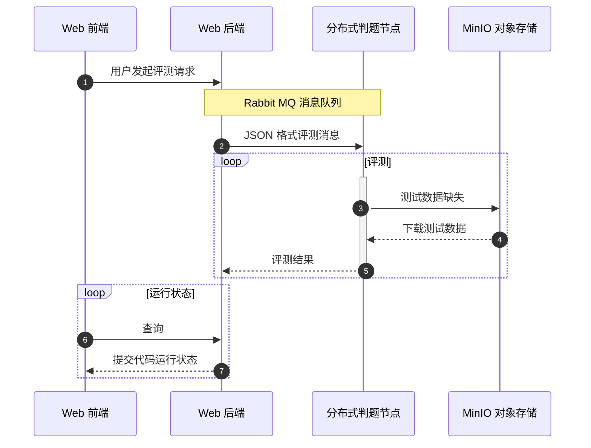

# 在线评测系统开发及升级

<div class="inline-block text-left mt-6">
报告人：颜俊梁

学号：917106840244

指导老师：余立功
</div>

<!--
The last comment block of each slide will be treated as slide notes. It will be visible and editable in Presenter Mode along with the slide. [Read more in the docs](https://sli.dev/guide/syntax.html#notes)
-->

---

<div class="flex justify-center mt-16">
  
</div>

---
layout: Contents
---

# 在线评测系统开发及升级

1. 引言

2. 系统实现

3. 分布式判题节点

4. 程序设计竞赛试题创建系统

<!-- # What is Slidev?

Slidev is a slides maker and presenter designed for developers, consist of the following features

- 📝 **Text-based** - focus on the content with Markdown, and then style them later
- 🎨 **Themable** - theme can be shared and used with npm packages
- 🧑‍💻 **Developer Friendly** - code highlighting, live coding with autocompletion
- 🤹 **Interactive** - embedding Vue components to enhance your expressions
- 🎥 **Recording** - built-in recording and camera view
- 📤 **Portable** - export into PDF, PNGs, or even a hostable SPA
- 🛠 **Hackable** - anything possible on a webpage

<br>
<br>

Read more about [Why Slidev?](https://sli.dev/guide/why) -->

<!--
You can have `style` tag in markdown to override the style for the current page.
Learn more: https://sli.dev/guide/syntax#embedded-styles
-->

---

# 引言

目前，计算机相关专业的学习在世界范围内掀起了热潮，越来越多的人接触到了计算机，开始学习程序设计。

在线评测系统广泛应用于计算机课程的教学和程序设计竞赛的训练之中。

很多在线评测系统存在各种各样的问题：

1. 学生使用的角度上，界面简陋，缺乏数学公式等内容的渲染；（图片）

2. 管理员使用的角度上，缺乏用户角色和权限管理机制，题目创建功能过于简单；

3. 评测系统设计实现的角度上，评测节点不支持动态扩展，运行学生提交的代码时可能存在安全隐患。

因此，在本毕业设计项目中，我开发了一个全新的在线评测系统，以解决这些问题，为学生学习和训练提供一个舒适的平台，
同时方便管理者对用户，题目和比赛进行管理，使得系统能够组织更大规模的程序设计竞赛。

---

# 系统实现

+ 使用 JVM 平台上的 Kotlin 语言，基于 Spring 系列框架开发了在线评测系统的 Web 后端，

+ 使用前端框架 Vue.js 开发了在线评测系统的 Web 前端

+ 基于 C++ 语言开发的 Linux 沙盒

+ 使用 TypeScript 语言和 Node.js 平台开发了分布式判题节点

---

# 系统架构

<div class="flex justify-center">
  
</div>

<!-- 本项目开发的系统包含用户交互的 Web 前端，系统逻辑的处理的 Web 后端，分布式判题节点和其它一些数据持久化中间件等部分 -->

---

# 功能模块

<div class="flex justify-center">
  
</div>

---

# 判题沙盒

判题节点是一个在线评测系统的核心部分。

判题节点恰好是整个系统服务器端中最脆弱的部分

判题节点不可避免地需要执行用户发送的不受信任的代码，这些代码很有可能会对服务器进行一些攻击操作

+ 文件系统攻击

+ 非法的网络连接

+ 非法的进程或线程操作

+ 编译器攻击

<!-- 
```c++
int main() {
  struct x struct z<x(x(x(x(x(x(x(x(x(x(x(x(x(x(x(y,x(y><y*,x(y*w>v<y*,w,x{}
  return 0;
}
``` 
-->

---

# 命名空间

命名空间机制实现了对各种系统资源的隔离。

以挂载点命名空间为例，实现了内核级别的文件目录隔离。

1. 准备一个临时的目录用于作为虚拟的根目录

2. 创建程序进程时切换到沙盒提供的临时 mnt 命名空间内

2. 将宿主机的文件目录从临时命名空间中剔除，使得新创建的进程无法访问原有宿主机的文件系统

3. 将提前创建好的虚拟根目录挂载到新进程当中，将程序运行必要的目录只读地挂载回新的命名空间

```cpp
if (mount("/", "/", NULL, MS_REC | MS_PRIVATE, NULL) == -1) {
  PLOG_E("mount('/', '/', NULL, MS_REC|MS_PRIVATE, NULL)");
  return false;
}
if (mount(NULL, destdir->c_str(), "tmpfs", 0, "size=16777216") == -1) {
  PLOG_E("mount('%s', 'tmpfs')", destdir->c_str());
  return false;
}
```

---

# CGroups

Linux 内核的 cgroups 实现了对于进程资源的追踪，限制和隔离，例如 CPU ，内存，磁盘等资源。

使用 setrlimit 系统调用可以用来限制进程的资源占用。

```cpp
struct rlimit64 rl;
rl.rlim_cur = rl.rlim_max = nsjconf->rl_as;
if (setrlimit64(RLIMIT_AS, &rl) == -1) {
   return false;
}
rl.rlim_cur = rl.rlim_max = nsjconf->rl_cpu;
if (setrlimit64(RLIMIT_CPU, &rl) == -1) {
   return false;
}
rl.rlim_cur = rl.rlim_max = nsjconf->rl_nproc;
if (setrlimit64(RLIMIT_NPROC, &rl) == -1) {
   return false;
}
```

---
layout: Mermaid
---

# 题目评测流程

<!-- <div class="flex justify-center">
  
</div> -->



---

# 程序设计竞赛试题创建系统

传统的在线评测系统中的题目创建都是简单地使用文件上传的方式进行的。

存在的问题：

1. 用户上传错误的文件

2. 无法保证上传数据的输入是符合期望的

3. 出题人的本地运行环境和评测节点的运行环境不一致

---

# 程序设计竞赛试题创建系统

<div class="flex justify-center">
  
</div>

---

# 数据库

```kotlin
interface User : Entity<User> {
  companion object : Entity.Factory<User>()
  var id: Long
  var username: String
  var nickname: String
  var password: String
}
object Users : Table<User>("users") {
  val id = long("id").primaryKey().bindTo { it.id }
  val username = text("username").bindTo { it.username }
  val nickname = text("nickname").bindTo { it.nickname }
  val password = text("password").bindTo { it.password }
}
```

---

# 数据库

```kotlin
database.users.find { it.id eq id }
```

```sql
select * from users where username = 'admin'
```

---

# Rest API

```kotlin
@RestController
@RequestMapping("/")
class UserController(
  private val userService: UserService
) {
  @PostMapping("/login")
  fun login(@Valid @RequestBody loginDto: UserLoginDto): UserLoginResponse {
    return userService.login(loginDto.username, loginDto.password)
  }
  @GetMapping("/profile")
  fun getMyProfile(@RequestAttribute user: UserProfile): UserProfile {
    return user
  }
}
```

---

# 过滤器

```kotlin
class UserAuthFilter(
  private val jwtService: JWTService,
  private val userRepository: UserRepository
) : Filter {
  override fun doFilter(
    request: ServletRequest, response: ServletResponse, chain: FilterChain
  ) {
    val req = request as HttpServletRequest
    val auth = req.getHeader(HttpHeaders.AUTHORIZATION)
    if (auth != null) {
      val optionalUsername = jwtService.verify(auth)
      if (optionalUsername.isPresent) {
        chain.doFilter(request, response)
      } else {
        makeUnAuthorizeResponse(response, "JWT 错误")
      }
    } else {
      makeUnAuthorizeResponse(response, "尚未登录")
    }
  }
}
```

---

# 试题创建流程

1. 设置试题元信息，即时间限制和空间限制的信息，以及题面描述信息。

2. 上传试题正确解法代码和其它需要测试的解法代码

3. 上传试题的输入数据校验器代码，并对数据校验器进行测试

4. 上传试题静态数据和相关数据生成器代码，配置数据生成器的生成命令。

5. 运行试题的生成和验证过程

---

# 试题构建

<div class="flex justify-center">
  
</div>

---

# 试题更新

1. 处理题目修改请求，获取待修改的题目编号和修改的内容；

2. 进行数据库的更新操作；

3. 如果是代码或者静态数据，则要将代码和静态数据上传至 MinIO 对象存储服务器中。

---

# 试题并发更新

测试数据文件非常大。

$10^6$ 个正整数的测试数据文件大小有 $30$ MB。

生成，上传和下载测试数据将会消耗大量时间。

将会暴露出巨大的数据竞争并发漏洞。

---
layout: cover
---

<div class="flex justify-center items-center">
  <div>
    <h1 class="text-center">感谢</h1>
    <h4 class="text-center">颜俊梁</h4>
  </div>
</div>
