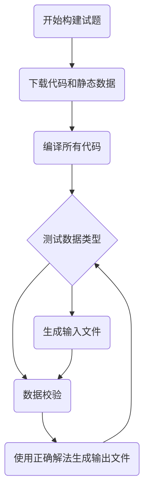

# 在线评测系统开发及升级

<div class="inline-block text-left mt-6">
  <div>
    <p class="flex justify-between"><div class="w-24 text-justify">报告人：</div><div class="w-36 text-center">颜俊梁</div></p> 
    <p class="flex justify-between"><div class="w-24 text-justify">学号：</div><div class="w-36 text-center">917106840244</div></p> 
    <p class="flex justify-between"><div class="w-24 text-justify">指导老师：</div><div class="w-36 text-center">余立功</div></p> 
  </div>
</div>

<!--
The last comment block of each slide will be treated as slide notes. It will be visible and editable in Presenter Mode along with the slide. [Read more in the docs](https://sli.dev/guide/syntax.html#notes)
-->

---
layout: Contents
---

# 在线评测系统开发及升级

1. 引言

2. 系统模块与架构

3. 分布式判题节点

4. 程序设计竞赛试题创建系统

---
layout: cover
class: text-center
---

# 1. 引言

---
class: intro
---

# 引言

<div v-click="1">
目前，计算机相关专业的学习在世界范围内掀起了热潮，越来越多的人接触到了计算机，开始学习程序设计。

计算机专业是一门理论和实践结合十分紧密的学科。
</div>

<p v-click="2">
在线评测系统广泛应用于计算机课程的教学和程序设计竞赛的训练之中。
</p>

<div v-click="3">


</div>

<p v-click="4">
在本毕业设计项目中，开发了一个全新的在线评测系统，为学生学习和训练提供一个舒适的平台。
</p>

<!-- 很多在线评测系统存在各种各样的问题：

1. 学生使用的角度上，界面简陋，缺乏数学公式等内容的渲染；（图片）

2. 管理员使用的角度上，缺乏用户角色和权限管理机制，题目创建功能过于简单；

3. 评测系统设计实现的角度上，评测节点不支持动态扩展，运行学生提交的代码时可能存在安全隐患。 -->

---

<div class="flex justify-center mt-16">
  
</div>

<!-- # What is Slidev?

Slidev is a slides maker and presenter designed for developers, consist of the following features

- 📝 **Text-based** - focus on the content with Markdown, and then style them later
- 🎨 **Themable** - theme can be shared and used with npm packages
- 🧑‍💻 **Developer Friendly** - code highlighting, live coding with autocompletion
- 🤹 **Interactive** - embedding Vue components to enhance your expressions
- 🎥 **Recording** - built-in recording and camera view
- 📤 **Portable** - export into PDF, PNGs, or even a hostable SPA
- 🛠 **Hackable** - anything possible on a webpage

<br>
<br>

Read more about [Why Slidev?](https://sli.dev/guide/why) -->

<!--
You can have `style` tag in markdown to override the style for the current page.
Learn more: https://sli.dev/guide/syntax#embedded-styles
-->

---
layout: cover
class: text-center
---

# 2. 系统模块与架构

---

# 系统架构

<div class="flex justify-center">
  
</div>

<!-- 本项目开发的系统包含用户交互的 Web 前端，系统逻辑的处理的 Web 后端，分布式判题节点和其它一些数据持久化中间件等部分 -->

---

# 系统实现

+ Web 后端：JVM 平台上的 Kotlin 语言和 Spring 系列框架

+ Web 前端：JavaScript 语言和前端框架 Vue.js

+ Linux 判题沙盒：C++ 语言

+ 分布式判题节点：TypeScript 语言和 Node.js 平台

---
clicks: 5
---

# 功能模块

+ 用户模块 <mdi-arrow-right-bold v-click="1" class="inline-block" /> <span v-click="1" class="inline-block">注册与登录</span>

+ 比赛模块 <mdi-arrow-right-bold v-click="2" class="inline-block" /> <span v-click="2" class="inline-block">组织线上或线下程序设计比赛</span>

+ 题库模块 <mdi-arrow-right-bold v-click="3" class="inline-block" /> <span v-click="3" class="inline-block">用户平时的编程练习</span>

+ 评测模块 <mdi-arrow-right-bold v-click="4" class="inline-block" /> <span v-click="4" class="inline-block">评测运行用户提交的程序代码</span>

+ 试题创建系统 <mdi-arrow-right-bold v-click="5" class="inline-block" /> <span v-click="5" class="inline-block">创建程序设计竞赛试题</span>

<style>
ul li {
  height: 2rem;
  line-height: 1;

  div {
    display: inline-flex;
    align-items: center;
  }
}
</style>

<!-- 
<div class="flex justify-center">
  
</div> -->


---
layout: cover
class: text-center
---

# 3. 分布式判题节点

---

# 判题沙盒

判题节点是在线评测系统的 **核心部分**，也是在线评测系统中 **最脆弱的部分**。

<div v-click>
  <div class="inline-flex justify-center absolute left-10">
    
  </div>

  <div class="inline-flex justify-center absolute left-80 top-50">
    
  </div>

  <div class="inline-flex justify-center absolute right-20 top-50">
    
  </div>
</div>

---

# 沙盒安全

判题节点不可避免地需要执行用户发送的 **不受信任的代码**。

这些代码很有可能会对服务器进行一些攻击操作：

+ 文件系统攻击

+ 非法的网络连接

+ 非法的进程或线程操作

+ 编译器攻击

+ ......

<div v-click>

<br />

使用 C++ 语言，Linux 系统内核提供**命名空间和 cgroups 等机制**，实现了一个**判题沙盒**。

</div>

<!-- 
```c++
int main() {
  struct x struct z<x(x(x(x(x(x(x(x(x(x(x(x(x(x(x(y,x(y><y*,x(y*w>v<y*,w,x{}
  return 0;
}
``` 
-->

---
class: intro2
---

# 命名空间

命名空间机制实现了**对各种系统资源的隔离**。

挂载点命名空间 mnt 实现了内核级别的文件目录隔离。


<!-- 
1. 准备一个临时的目录用于作为虚拟的根目录

2. 创建程序进程时切换到沙盒提供的临时 mnt 命名空间内

2. 将宿主机的文件目录从临时命名空间中剔除，使得新创建的进程无法访问原有宿主机的文件系统

3. 将提前创建好的虚拟根目录挂载到新进程当中，将程序运行必要的目录只读地挂载回新的命名空间 -->

<!--

命名空间


if (mount("/", "/", NULL, MS_REC | MS_PRIVATE, NULL) == -1) {
  PLOG_E("mount('/', '/', NULL, MS_REC|MS_PRIVATE, NULL)");
  return false;
}
if (mount(NULL, destdir->c_str(), "tmpfs", 0, "size=16777216") == -1) {
  PLOG_E("mount('%s', 'tmpfs')", destdir->c_str());
  return false;
}

-->

---

# CGroups

CGroups 机制实现了对于**进程资源的追踪和限制**，例如 CPU，内存和磁盘等。

使用 setrlimit 系统调用可以用来限制进程的资源占用。

```cpp
struct rlimit64 rl;
rl.rlim_cur = rl.rlim_max = nsjconf->rl_as;
if (setrlimit64(RLIMIT_AS, &rl) == -1) {
   return false;
}
rl.rlim_cur = rl.rlim_max = nsjconf->rl_cpu;
if (setrlimit64(RLIMIT_CPU, &rl) == -1) {
   return false;
}
rl.rlim_cur = rl.rlim_max = nsjconf->rl_nproc;
if (setrlimit64(RLIMIT_NPROC, &rl) == -1) {
   return false;
}
```

<div class="absolute" style="top: 14.5rem; left: 22rem;"><mdi-arrow-right-bold class="inline-block pb-1" />地址空间大小</div> 

<div class="absolute" style="top: 19rem; left: 22rem;"><mdi-arrow-right-bold class="inline-block pb-1" />CPU 时间</div> 

<div class="absolute" style="top: 24rem; left: 22rem;"><mdi-arrow-right-bold class="inline-block pb-1" />子进程数量</div> 

---

# 判题沙盒防御实例

恶意代码试图执行 `rm -rf / --no-preserve-root` 命令删除文件系统。

```c
#include <stdlib.h>

int main() {
  system("rm -rf / --no-preserve-root");
}
```

<p v-click>
使用 strace 跟踪它执行的系统调用：

```text
13202 1622479041.760245 execve("/usr/bin/rm", ["rm", "-rf", "/", "--no-preserve-root"], ...)
```
</p>

<p v-click>
但是，所有执行删除的系统调用都失败了：

```text
13202 1622479041.787068 unlinkat(5, "protocols", 0) = -1 EROFS (Read-only file system)
13202 1622479041.787306 newfstatat(5, "protocols", {st_mode=S_IFREG|0644, st_size=2932, ...}, AT_SYMLINK_NOFOLLOW) = 0
13202 1622479041.787697 write(2, "rm: ", 4) = 4
13202 1622479041.787922 write(2, "cannot remove '/etc/protocols'", 30) = 30
13202 1622479041.788154 write(2, ": Read-only file system", 23) = 23
13202 1622479041.788375 write(2, "\n", 1) = 1
```
</p>

---

# 分布式判题节点

运行选手提交的程序会消耗大量的时间。

为了提高吞吐量，让很多判题沙盒同时工作。

<div v-click>

引出了三个问题：

+ 判题节点与 Web 后端之间的通信

+ 判题节点之间的并发调度

+ 判题节点中题目数据的获取

</div>

---
layout: Mermaid
---

# 题目评测流程

<!-- <div class="flex justify-center">
  
</div> -->


---

# 分布式判题节点

<div class="flex justify-center mt-16">
  
</div>

---
layout: cover
class: text-center
---

# 4. 程序设计竞赛试题创建系统

---

# 程序设计竞赛试题创建系统

传统的在线评测系统中的题目创建都是采用文件上传的方式。

存在的问题：

1. 难以管理大量测试数据

2. 出题人的本地运行环境和评测节点的运行环境不一致

3. 输入数据出现错误，不符合题目描述

---

# 程序设计竞赛试题创建系统

<div class="flex justify-center">
  
</div>

---

# 程序设计竞赛试题

+ 时间和空间限制
+ 题面描述
+ **测试数据**

<div v-click>

**测试数据必须正确**。

测试数据通常使用以下两种方法：

+ 手动构造
+ 编写代码生成

</div>

---

# 测试数据

<div class="flex justify-start">
  
</div>

<h4 class="mt-4 mb-4">
  <mdi-close-thick class="inline text-red-500 mb-1" /> 测试数据：
</h4>


```text
-1 -2
```

---

# 测试数据

数据校验器：

```cpp
#include "testlib.h"

using namespace std;

int main(int argc, char* argv[]) {
  registerValidation(argc, argv);
  inf.readInt(0, 1000000000, "a");
  inf.readSpace();
  inf.readInt(0, 1000000000, "b");
  inf.readEoln();
  inf.readEof();
}
```

数据 <span class="code px-1">-1 -2</span> 将会输出如下错误日志：

```text
FAIL Integer parameter [name=a] equals to -1, violates the range [0, 10^9] (stdin, line 1)
```

<style>
.code {
  font-family: "Fira Code", monospace;
  font-size: 0.9em;
  background: var(--prism-background);
  border-radius: 0.25rem;
  font-weight: 300;
  padding-top: 0.125rem;
  padding-bottom: 0.125rem;
}
</style>

---

# 试题的组成

+ 时间和空间限制
+ 题面描述
+ **正确解法**
+ **数据校验器**
+ **数据生成器**
+ **静态数据**

---
class: intro3
---

# 试题的构建

<!-- <div class="flex justify-center">
  
</div> -->



---

# 试题的更新

1. 处理题目修改请求，获取待修改的题目编号和修改的内容；

2. 进行数据库的更新操作；

3. 如果是代码或者静态数据，则要将代码和静态数据上传至 MinIO 对象存储服务器中。

---

# 试题并发更新

测试数据文件非常大。

$10^6$ 个正整数的测试数据文件大小有 $30$ MB。

生成，上传和下载测试数据将会消耗大量时间。

将会暴露出巨大的数据竞争并发漏洞。

---
layout: cover
---

<div class="flex justify-center items-center">
  <div>
    <h1 class="text-center">感谢</h1>
    <h4 class="text-center">颜俊梁</h4>
  </div>
</div>
